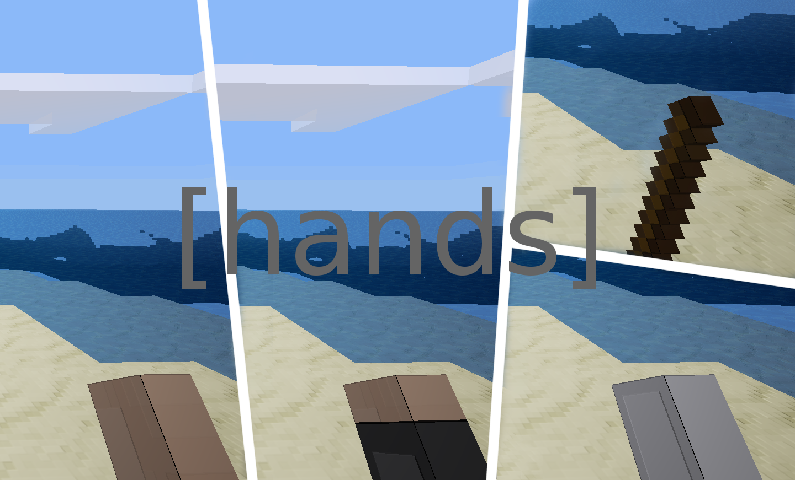

Interchangeable Hands [hands]
------------------------------
* License: MIT (see LICENSE)
* [GitHub Repository](https://github.com/octacian/hands)

This mod uses the function introduced in this [pull request](https://github.com/minetest/minetest/pull/2827) by [TeTpaAka](https://github.com/TeTpaAka). Hands is mostly for demostration purposes for the reference of other modders or for players to mess around with. Keep in mind that the mod does **not** work on Minetest 0.4.14, as the feature was not introduced until Minetest 0.4.15.

The mod registers a single chatcommand (`/sethand`) and privilege (`sethand`), allowing the player to set their own hand to any node or item. Hands also has a simple API with which two example hands are registered as listed below.

### Alternate Hands
* `hands:grey`
* `hands:space`

The textures aren't very good, but it allows you to get a basic and functional overview of the new feature.

### Chatcommand
```
/sethand hands:grey
/sethand default:stick
```

The above example shows that the `/sethand` command works both with the hands introduced by the mod or with any other node or item already in the game. Remember to grant yourself the `sethand` privilege before attempting to use the chatcommand.

### API
Though I highly doubt that this mod would actually need an API and be expanded as a stand-alone mod, I decided to provide one in case somebody wanted to. Overall, it's pretty single. The only required parameter is the `itemstring`/`handstring`.

```lua
hands.register_hand(<itemstring>, {
  wield_image = <wield image>,
  wield_scale = <wield scale>,
  tool_capabilities = <tool capabilities>,
})
```

All of the fields except for the itemstring are optional, though it's pretty pointless to register a new hand without a wield image.

#### API Examples
Simplistic:
```lua
hands.register_hand("hands:space", {
  wield_image = "hands_space.png",
})
```

Fine Tuned:
```lua
hands.register_hand("hands:space", {
  wield_image = "hands_space.png",
  wield_scale = {x=1,y=1,z=2.5},
  tool_capabilities = {
  		full_punch_interval = 0.9,
  		max_drop_level = 0,
  		groupcaps = {
  			crumbly = {times={[2]=3.00, [3]=0.70}, uses=0, maxlevel=1},
  			snappy = {times={[3]=0.40}, uses=0, maxlevel=1},
  			oddly_breakable_by_hand = {times={[1]=3.50,[2]=2.00,[3]=0.70}, uses=0}
  		},
  		damage_groups = {fleshy=1},
  	}
})
```